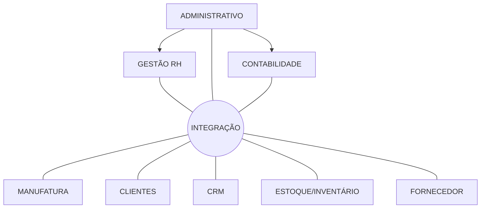

# _G01Y6 - Fundamentos de Sistemas de Informação_ - Revisão semanal

## 26/05/2023 - ERP

### Vocabulário
- ERP ≅ INTEGRAÇÂO + TRANSPARÊNCIA
- CRM ≅ Relacionamento c/ Cliente --> CAPTAR + MANTER

---
## Referências
- [SAP](https://www.sap.com/brazil/products/erp/what-is-sap-erp.html)
- [TOTVS](https://www.totvs.com/sistema-de-gestao/)
- [FOCCO](https://foccoerp.com.br/)
